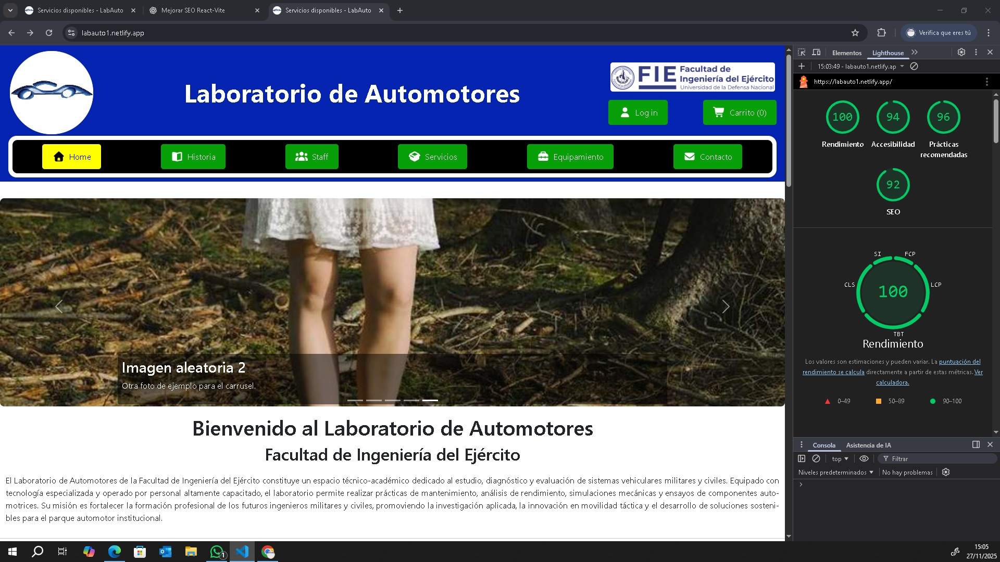

# Laboratorio de Automotores Web Page:

  

## 📦 Estructura del Proyecto "labautoe":
### ⚙️ Configuración base:
- Vite: labautoe/vite.config.js
- HTML de entrada: labautoe/index.html
- Dependencias y lock:
- labautoe/package.json
- labautoe/pnpm-lock.yaml
- ESLint: labautoe/eslint.config.js

---

## 🧩 Código fuente:
### 📌 App principal:
- labautoe/src/App.jsx

---

## 🧱 Componentes:
### Ubicados en labautoe/src/components:
- BotonHeader.jsx
- Carrito.jsx
- FloatingText.jsx *(Texto flotante logo Laboratorio)*
- Footer.jsx — Pie de página
- FormularioContacto.jsx — Formulario institucional
- Gallery.jsx — Galería de imágenes *(es lo que muestro en el raiz y repito en las demas paginas renderizadas)*
- Header.jsx — Encabezado institucional con logos del Laboratorio y la Institución
- Nav.jsx — Navegación principal c/botones a continuación Header
- Servicios.jsx *(equivalente a Productos)*
- SitioEnCostrucción.jsx *(componente que muestro en los lugares que aún no he armado)*
- StaffLaboratorio.jsx — Vista del equipo técnico

---

## 🎨 Estilos:
Se integran con algunos estilos de Bootstrap, por ejemplo el carrusel y otros para diseño respondivo *(por ejemplo menú hamburguesa)*
### Ubicados en labautoe/src/styles:
- boton-header.module.css
- carrito.module.css
- floating-text.module.css
- footer.module.css
- formulario-contacto.css **
- formulario-servicio.module.css
- gallery.module.css
- gestion-servicio.module.css
- header.module.css
- historia-laboratorio.module.css
- home.module.css
- login.module.css
- navbar.module.css
- servicio-detalle.css **
- servicios.css **
- sitio-en-construccion.css **
- staff-laboratorio.css **

---

## 📁 Páginas del proyecto:
### Ubicados en labautoe/src/components:

#### 📖 Historia (`/historia`)
Reseña histórica del Laboratorio de Automotores, incluyendo origen, evolución y misión institucional. *(Una breve muestra)*

#### 👥 Staff (`/staff`)
Información sobre el equipo técnico y académico del laboratorio.

#### 🛠️ Servicios (`/servicios`)
Listado de servicios técnicos ofrecidos por el laboratorio, con descripción funcional y disponibilidad. *(se renderiza el componente Servicios puro)*

#### 🧰 Equipamiento (`/equipos`)
Listado de equipos disponibles en el laboratorio. *(En construcción)*

#### ✉️ Contacto (`/contacto`)
- Formulario para consultas institucionales.

#### 🛒 Carrito (`/carrito`)
- Resumen de servicios seleccionados por el usuario. *(Se agregó el useContext)*
- Se muestra en una tabla 
- Se totaliza el total de precio.
- Se hacen los subTotales por ítem agregado
- Se subtotaliza por ítem agregado
- Se totaliza ítems carrito
- Se agrega botón vaciar carrito

### Ubicados en labautoe/src/context:
- AuthContext
- CarritoContext
- ServiciosContext

### Ubicados en labautoe/src/pages:
- Admin *(para administrar los servicios / productos)*
  Se renderiza GestionServicio -> se sirve FormularioServicio

- Historia *(Historia del Laboratorio de Automotores)*
#### 🏠 Home (`/`)
Página principal con presentación institucional  y servicos ofrecidos.
- Home  *(aquí renderizo el componente Servicios + una descripción Lab)*

- Login *(para el Logueo de la página y mostrar el carrito ó adminsitrar)*
- SerivicoDetalle *(para mostrar el detalle de cada servicio ofrecido)*

---
## SEO experiment:

- queda para mejorar bastante todo el tema de imagenes de la API mockapi e imagenes que debiera agregar una lógica para utilizarla con diferentes resoluciones de acuerdo al tamaño de pantalla *(y servirlas internamente desde /images, solo lo hice para los 1eros servicios, pero estan en una sola resolución)*
- /public/_headers *para el despliegue en Netlify*
- /vercel.json *para el despliegue en Vercel*
- Se agrega **HELMET** 
  -- App
  -- Main
  -- Servicios
  -- Historia
  -- Home
- /ser/types/bootstrap.d.ts *(para cargar CSS de bootstrap lazy / a medida que se utilizan)*

---

## 🧭 Rutas principales:

| Ruta           | Componente Renderizado  | Estado   | Descripción breve                           |
|----------------|-------------------------|----------|---------------------------------------------|
| `/`            | `Gallery + Home + Serv` |    ✅   | Página principal del sitio                  |
| `/home`        | `Gallery + Home + Serv` |    ✅   | Página servicios y carrito                  |
| `/historia`    | `SitioEnConstruccion`   |    ✅   | Aún para desarrollar                        |
| `/staff`       | `StaffLaboratorio`      |    ✅   | Información sobre el equipo del laboratorio |
| `/servicios`   | `Servicios`             |    ✅   | Solo servicos -> carrito                    |
| `/equipamiento`| `SitioEnConstruccion`   |    🚧   | Aún para desarrollar                        |
| `/contacto`    | `FormularioContacto`    |    ✅   | Formulario institucional de contacto        |
| `/carrito`     | `Carrito`               |    ✅   | Se pasa carrito total y subtotales          |
| `/Login  `     | `Login / Logout`        |    ✅   | Entra web p/carrito o Admin                 |

---
---

## 📍 Ubicación y contacto:
**Facultad de Ingeniería del Ejército "Grl. Div. Manuel N. Savio"**  
 Av. Cabildo 15, C1426AAA Ciudad Autónoma de Buenos Aires, Argentina   
📞 Teléfono: (+54 11) 4779-3300  
 e-mail Institucional: [info@fie.undef.edu.ar](mailto:info@fie.undef.edu.ar)  
 e-mail Laboratorio: [automotores@fie.undef.edu.ar](mailto:automotores@fie.undef.edu.ar)  
🌐 Sitio web: [www.fie.undef.edu.ar](https://www.fie.undef.edu.ar)  
📌 [Google Maps](https://www.google.com/maps?q=Av.+Cabildo+15,+C1426+Ciudad+Aut%C3%B3noma+de+Buenos+Aires,+Argentina)  
<a href="https://web.whatsapp.com/send?phone=5491138569689&text=Hola%2C+quisiera+consultar+sobre+el+Laboratorio+de+Automotores." target="_blank">
   Mensaje Institucional FIE
</a>  